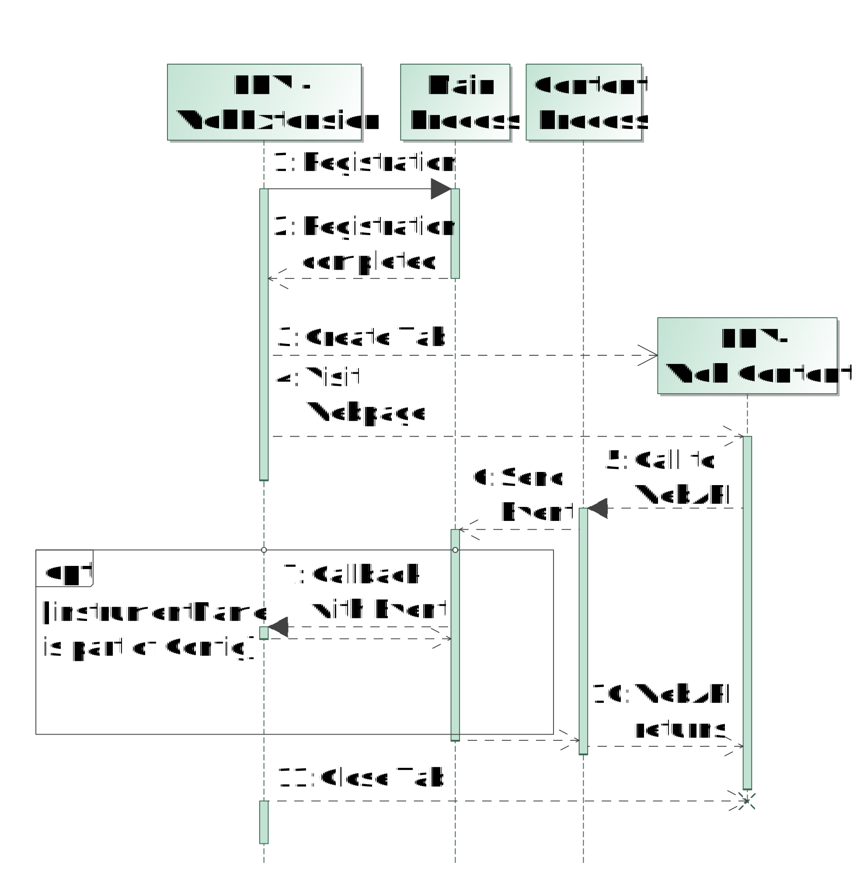

JS Instrument technical documentation
=====================================

Of all the Instruments in the OpenWPM WebExtension the one that is most likely
to collect the most information is the Javascript instrument.
It allows users to specify which WebAPI calls they are interested in and 
receive a full breadth of information on how websites use the instrumented APIs.

To allow for this rich data collection it employs a number of tricks and subtleties
which this document aims to capture.

TL;DR: We pass the configuration to a content script in the WebExtension. In the content
scope generate a string that contains the script we want to execute on the page
and then insert it in into the page.
This script is literally a format string in which the configuration gets embedded via
``JSON.stringify``.

Setting up the instrumentation
------------------------------

In the JavascriptInstrument class which runs in the background script, we register two content
scripts to run at ``document_start`` these are:

1. A dynamically generated script that sets ``window.openWpmContentScriptConfig`` to the
   ``JSON.stringified`` value of the contentScriptConfig.
2. ``content.js`` which is the combination of ``javascript-instrument-page-scope`` and
   ``javascript-instrument-content-scope`` as produced by webpack

By setting those two in this order we are able to pass a parameter to the content script.
I currently do not know of another way to dynamically pass config from the background to the
content scope but this feels hacky.

In ``javascript-instrument-content-scope`` we then create a massive string that contains
all of the following:

1. The ``lib/js-instruments.ts`` file, where the actual instrumenting happens
2. The ``jsInstrumentationSettings`` as a JSON object
3. The ``javascript-instrument-page-scope`` which contains the setup and sendMessagesToLogger
   functions

This string is then injected into the page scope where ``javascript-instrument-page-scope``
starts executing, pulling the testing and event parameter out of data attributes on it's
script node. It then calls into ``lib/js-instruments.ts`` which then does the actual
instrumentation.

See CurrentFlow_ for a diagram I made as part of my bachelor's thesis to demonstrate the flow of
information

.. _CurrentFlow:

        the web page and the propagation of events captured by the JavaScript instrument
        to OpenWPM's execution platform (at the left)

Data collection
---------------

TL;DR: We wrap each WebAPI that we should instrument and forward all calls to us
to the underlying object, while logging the accesses. This is done by the injected
script mentioned above.

Getting the data into the Database
----------------------------------

Since the data collection happens in the website scope, but we care about it
in the in the database, we had to figure out a way to get it there.

We do this via the following steps:

1. Dispatch a custom event via ``document.dispatchEvent`` in ``javascript-instrument-page-scope``
2. Register a listener for the custom event in ``javascript-instrument-content-scope`` and
   call ``runtime.sendMessage`` to pass it from the content scope into the background scope
3. Where ``javascript-instrument`` (in the background scope) receives the message and forwards it to the ``loggingdb``